# audiovis

**A single-binary, live, audio-reactive VJ visualizer** — VHS / analog-video and
demoscene aesthetics, generated entirely in real time, driven over **MIDI**,
**OSC** and an embedded **web control surface**.

Built for the club: it runs windowed on a desktop and headless on tiny
single-core ~1 GHz ARM boards (Raspberry Pi Zero, NTC C.H.I.P.) straight to the
framebuffer — no X11, no Wayland, no pre-rendered clips.

## Presets

<table>
<tr>
<td>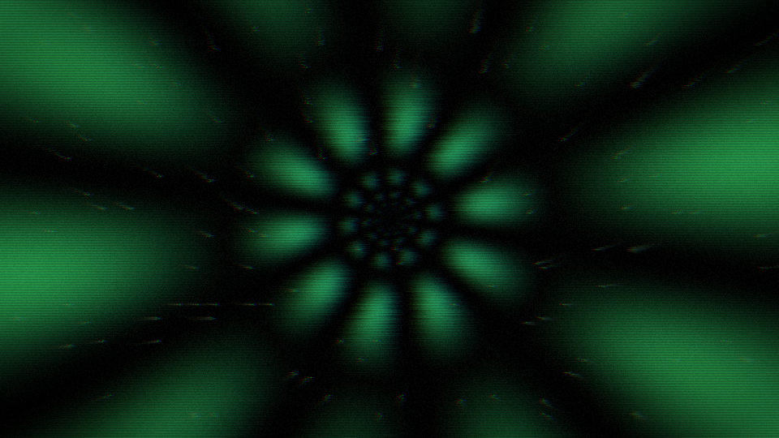<br><sub>berlin-tunnel</sub></td>
<td>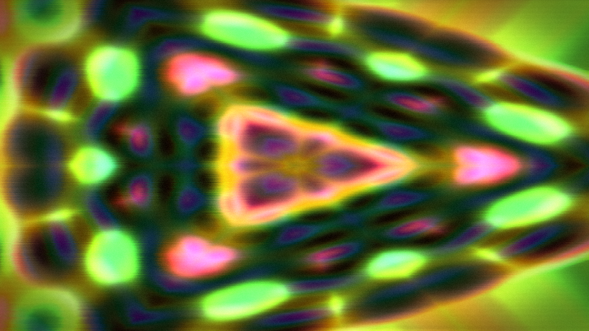<br><sub>acid-kaleido</sub></td>
<td>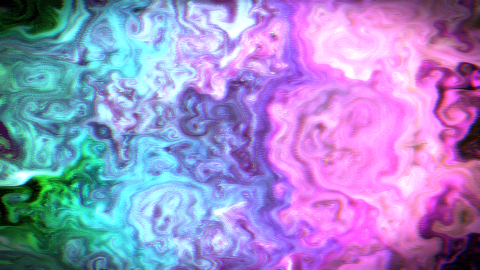<br><sub>smoke-room</sub></td>
<td>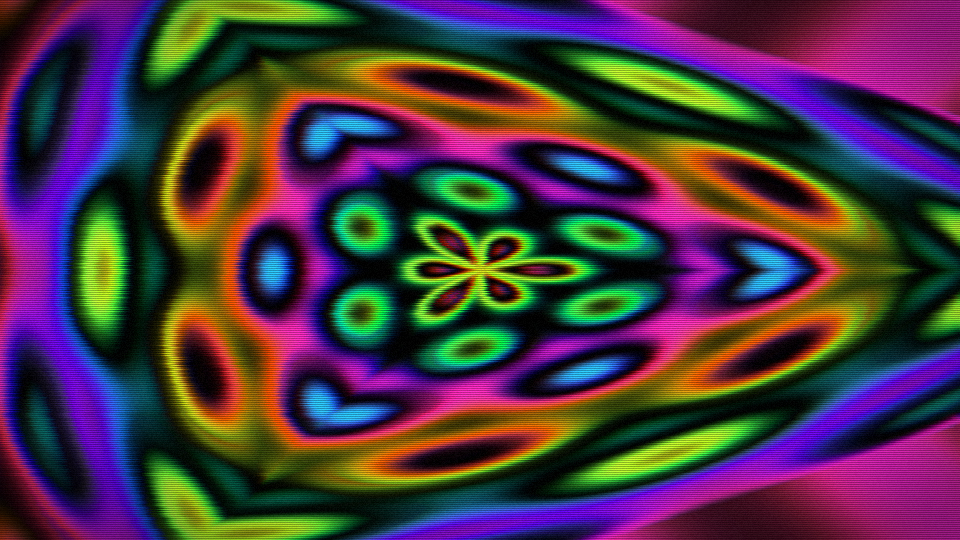<br><sub>mandala-trip</sub></td>
</tr>
<tr>
<td>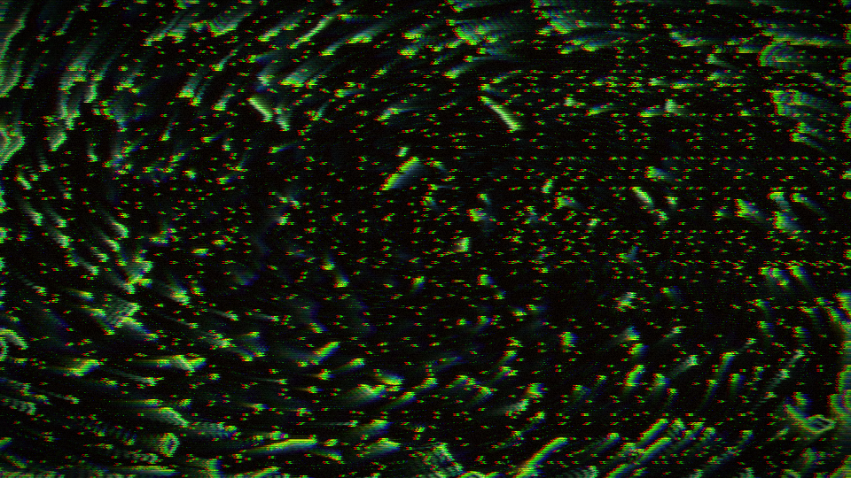<br><sub>spiral-waves</sub></td>
<td>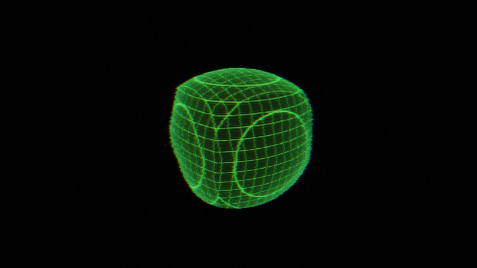<br><sub>wireframe</sub></td>
<td>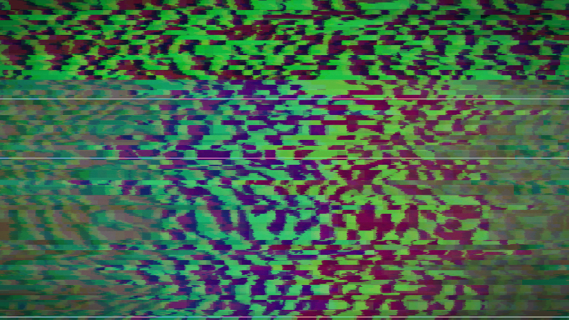<br><sub>glitch-city</sub></td>
<td>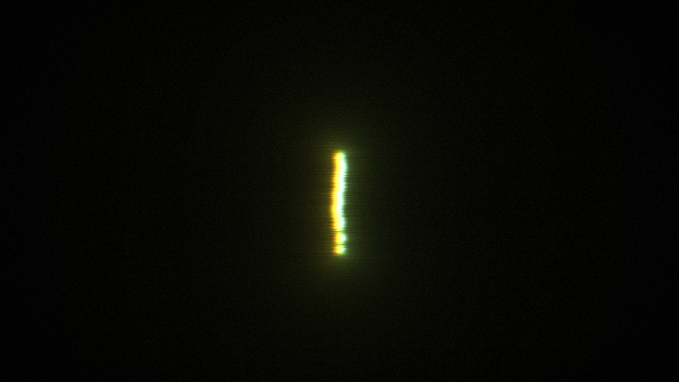<br><sub>vectorscope</sub></td>
</tr>
<tr>
<td>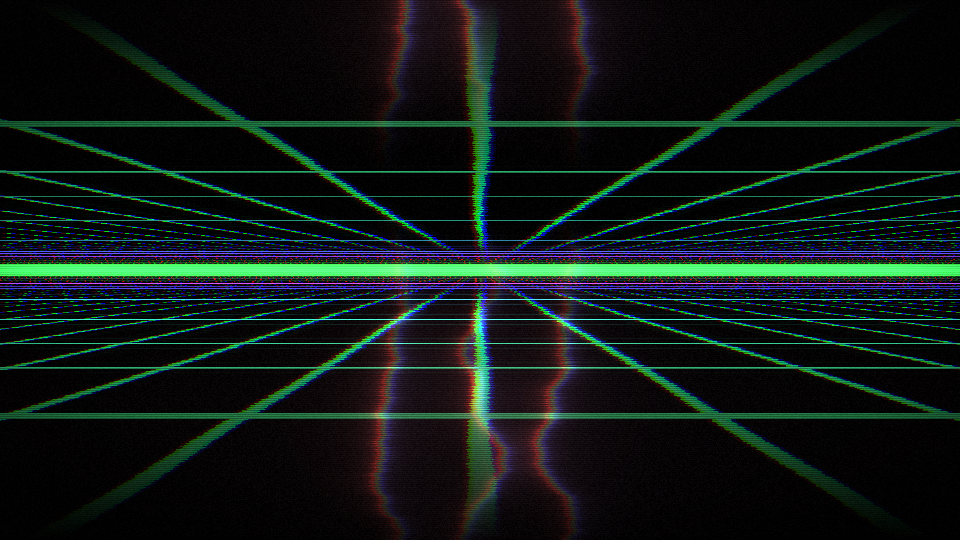<br><sub>neon-grid</sub></td>
<td>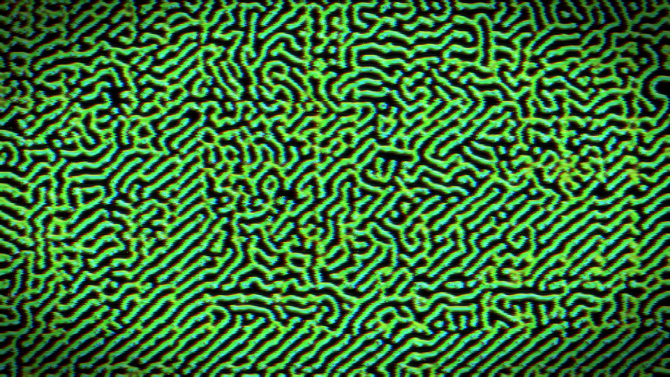<br><sub>reaction-bloom</sub></td>
<td>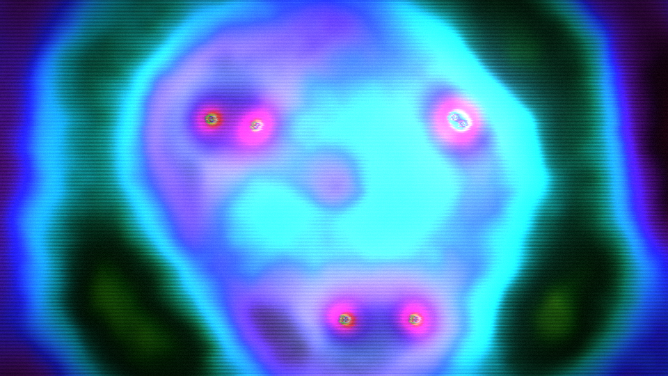<br><sub>plasma-bloom</sub></td>
<td>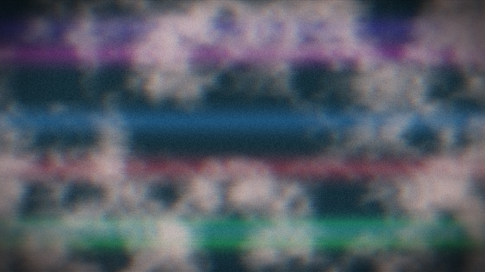<br><sub>vhs-dream</sub></td>
</tr>
</table>

*Sixteen builtin presets ship in the binary; the last-used one auto-loads on
launch. All frames here are generated live (no audio input).*

## Web control surface

A dense, dark instrument surface served straight from the binary — per-layer
decks, the media layers, the effects rack, audio analyzer, the I/O picker, the
modulation grid and a **live output monitor** that floats over the page (drag it
anywhere, resize it from the corner, fold it away). Everything is two-way synced
over a protobuf websocket.

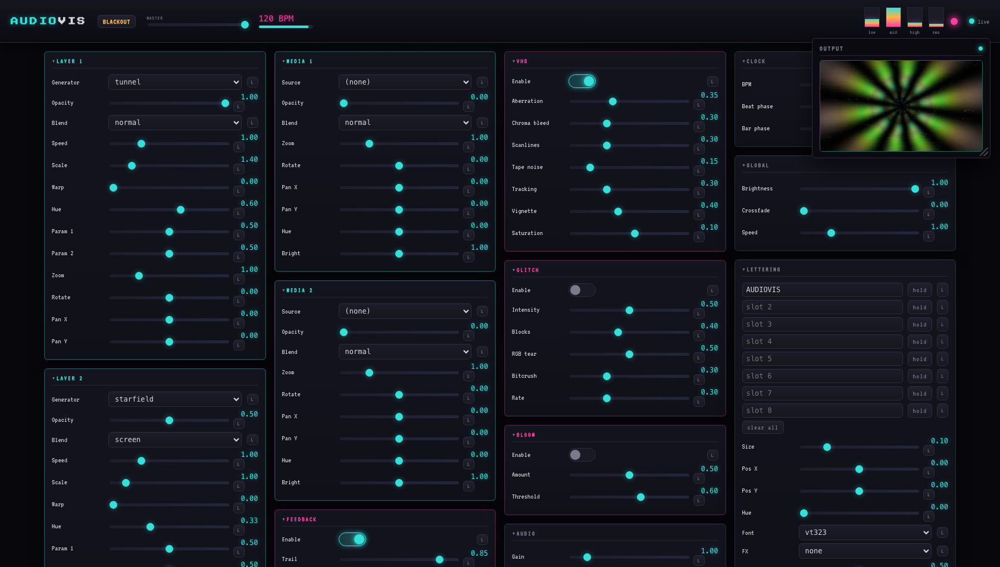

## Generators

38 of them — procedural fields, demoscene classics, fractals, a stereo scope, a
morphing wireframe solid, and three living simulations (reaction-diffusion,
spiral-wave excitable medium, curl-noise smoke). Each layer can run any of them.

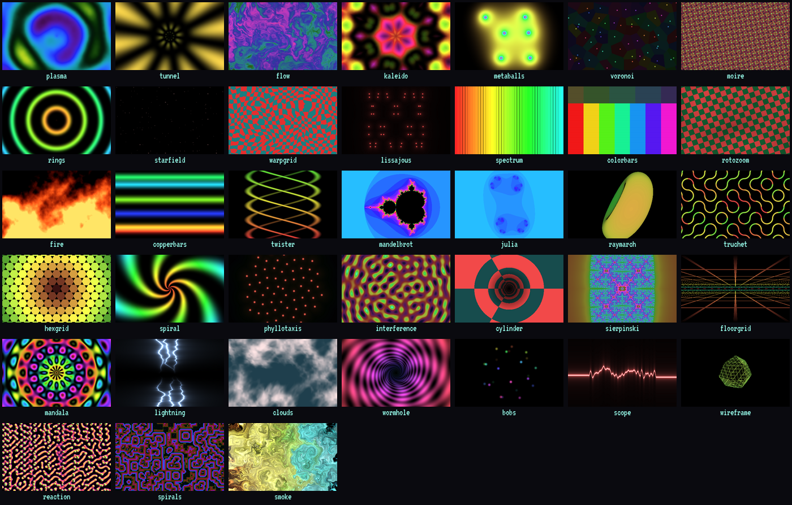

## Effect chain

Composited layers run through a chain of toggleable, modulatable effects:
**feedback** (infinite-zoom trails), **mirror / kaleidoscope**, **hue-cycle**,
**lo-fi** (pixelate + posterize), analog **VHS**, **glitch / datamosh** and
**bloom**.

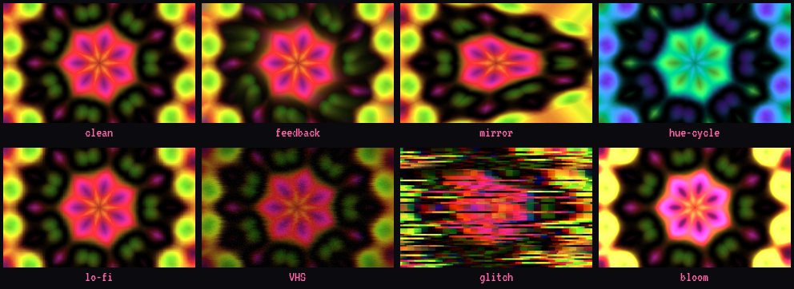

## Media layers

Two extra layers load your own **images (PNG/JPG)** or **SVG** from a `media/`
folder and composite them over the generators with the same transform vocabulary
(zoom / rotate / pan), plus hue, brightness, opacity and blend mode. SVGs are
rasterised once on load; the picker in the web UI lists whatever you drop in.

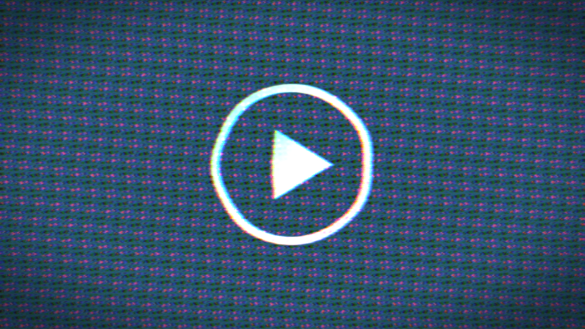

## Everything is modulated

A **grid patchbay** routes signal sources onto any parameter, with per-route
depth and smoothing:

- **audio** — low / mid / high bands, RMS, onset, all auto-gained;
- **beat clock** — phase, locked to incoming MIDI clock or free-running;
- **six LFOs** — nine waveforms (sine, triangle, saw up/down, square, pulse,
  sample-&-hold, smooth-noise, steps), tempo-synced to musical divisions.

Per-layer **transforms** (zoom / rotate / pan) and a **lettering bank** — eight
MIDI-note-gated text slots (show on note-on, hide on note-off), seven baked
pixel fonts and text FX (dissolve / wave / tear / scanlines) — round it out.

## Control

- **Web UI** at `http://<host>:8080` — the surface above: master + blackout, the
  decks, effects rack, modulation grid, LFO scopes, preset & lettering panels,
  MIDI map and the floating output monitor, two-way synced over a protobuf
  websocket.
- **MIDI** — notes / CC / clock; opens a virtual port ("audiovis") and
  auto-connects hardware; per-control **learn**. Pick the hardware port live
  from the I/O panel.
- **OSC** — `/p/<param.path> <value>` sets anything; other addresses are
  learnable.
- **Audio in** — choose the input device in the I/O panel and tune the analyzer
  live (gain, attack, release, beat sensitivity); they double as modulation
  targets.
- **Fullscreen** — press **F** in the render window to toggle borderless
  fullscreen on the monitor it is currently on (drag it to an external display
  first, then F).

## Build & run

```sh
cargo build --release        # self-contained binary (web UI + assets embedded)
./target/release/audiovis    # windowed, web UI on :8080

# headless on a Pi / C.H.I.P., straight to the framebuffer:
audiovis --backend drm --width 1280 --height 720 --render-scale 0.5 --fps 30
```

`audiovis --help` lists every option; each has an `AV_*` environment equivalent.

## How it works

Raw OpenGL ES 2.0 via `glow` (so it runs on VideoCore IV / Mali-400 as well as
desktop GL); generators and effects are full-screen fragment shaders written to
the GLES2 / desktop-GL common subset. Audio is captured with `cpal` and analysed
through a mel filterbank; control is `midir` + `rosc`; the web server is `axum`
serving an embedded UI that speaks protobuf (`prost`) over a websocket.

## License

MIT.
