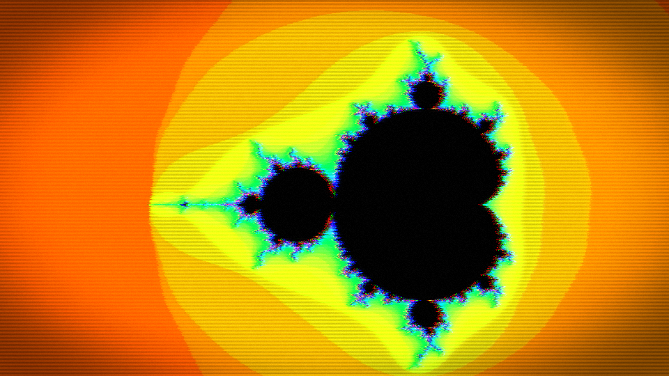
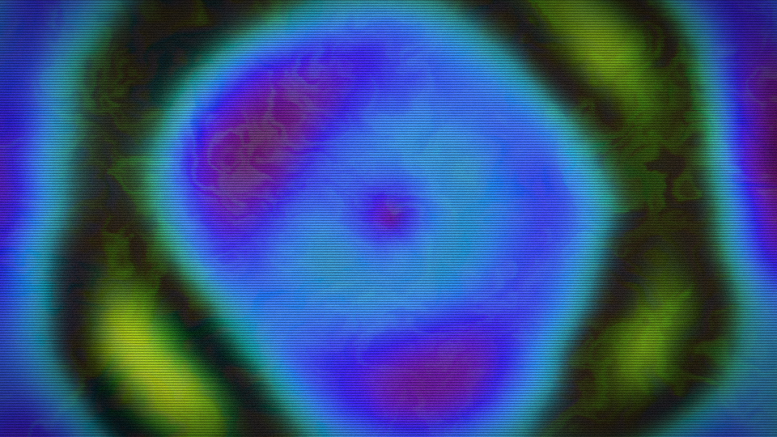
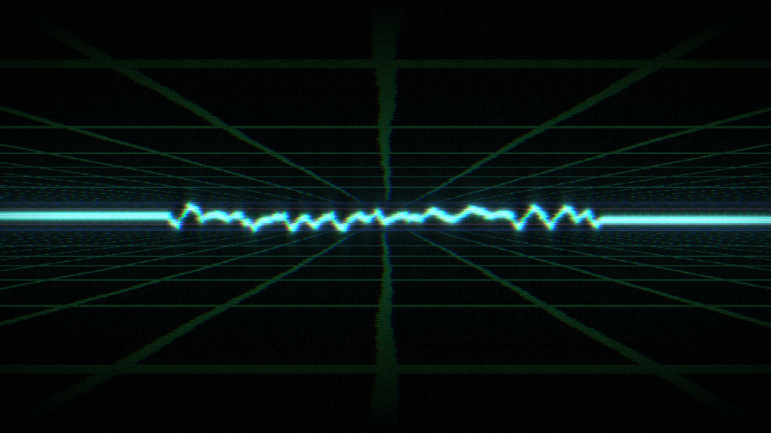

# audiovis

A single-binary, live, audio-reactive **VJ visualizer** with a VHS / retro /
analog-video and demoscene aesthetic. It generates everything algorithmically
(no pre-rendered clips), reacts to live audio, and is driven in performance over
**MIDI**, **OSC** and an embedded **web control surface**.

It runs on a capable desktop (windowed on macOS / Linux) and on very small
hardware — single-core ~1 GHz ARM boards like the Raspberry Pi Zero or NTC
C.H.I.P. — rendering straight to the framebuffer with no X11 or Wayland.

## Gallery

<table>
<tr>
<td><br><sub>berlin-tunnel</sub></td>
<td><br><sub>acid-kaleido</sub></td>
<td><br><sub>smoke-room</sub></td>
<td><br><sub>mandala-trip</sub></td>
</tr>
<tr>
<td><br><sub>spiral-waves</sub></td>
<td><br><sub>reaction-bloom</sub></td>
<td><br><sub>glitch-city</sub></td>
<td><br><sub>mandelzoom</sub></td>
</tr>
<tr>
<td><br><sub>neon-grid</sub></td>
<td><br><sub>plasma-bloom</sub></td>
<td><br><sub>vhs-dream</sub></td>
<td><br><sub>init</sub></td>
</tr>
<tr>
<td><br><sub>wireframe</sub></td>
<td><br><sub>vectorscope</sub></td>
<td><br><sub>oscillo</sub></td>
<td></td>
</tr>
</table>

*All frames are generated live; these are the bundled presets, captured at a
random moment with no audio input.*

## What's in it

- **36 generators** — sine plasma, tunnels, flow fields, kaleidoscope,
  metaballs, voronoi, moire, audio rings, starfield, warp grids, Lissajous
  scope, spectrum bars, colour bars, rotozoom, fire, copper bars, twister,
  Mandelbrot, Julia, raymarched torus, Truchet, hex grid, spirals,
  phyllotaxis, interference, cylinder, Sierpinski, perspective floor, mandala,
  lightning, clouds, wormhole, bobs — plus stateful simulations:
  **reaction-diffusion** (Gray-Scott), **spiral waves** (Greenberg-Hastings
  excitable medium) and **curl-noise smoke**.
- **3-layer compositor** — each layer runs any generator with its own knobs,
  per-layer transform (zoom / rotate / pan), blend mode and opacity.
- **Effect chain** — video **feedback** (infinite-zoom trails), **mirror /
  kaleidoscope**, **hue-cycle**, **lo-fi** (pixelate + posterize), analog
  **VHS** (aberration / chroma bleed / scanlines / tape noise / tracking /
  vignette), **glitch / datamosh** (slice displacement, RGB desync, block
  compression, dropouts, bitcrush) and **bloom**.
- **Modulation matrix** — a grid patchbay routing audio bands, the onset, the
  beat-clock phase and **six tempo-synced LFOs** (nine waveforms each) onto any
  parameter, with per-route depth and smoothing.
- **Lettering bank** — eight MIDI-triggerable text slots, multiple baked pixel
  fonts (system / bold / outline / alien) and text FX (dissolve / wave / tear /
  scanlines).
- **Presets** — curated builtins embedded in the binary, save/recall in the
  browser, autoloads the last one on launch.
- **Beat clock** — free-running tempo that locks to incoming MIDI clock.

## Control

- **Web UI** — served by the binary at `http://<host>:8080`; a live control
  surface with master + blackout, per-layer decks, the effects rack, the
  modulation grid, LFO scopes and the preset/lettering panels. Two-way synced
  over a websocket (protobuf), so MIDI/OSC moves show up there too.
- **MIDI** — notes, CC and clock; opens a **virtual port** ("audiovis") so a
  DAW or sequencer can drive it, and auto-connects hardware ports. Per-control
  **learn**.
- **OSC** — over UDP; `/p/<param.path> <value>` sets any parameter directly,
  any other address is learnable.

## Build

```sh
cargo build --release
```

The optional camera / video input layer is behind a feature flag:

```sh
cargo build --release --features camera
```

The release binary embeds the web UI and all assets — it is self-contained.

## Run

```sh
audiovis                       # windowed, web UI on :8080
audiovis --backend drm \       # headless on a Pi/C.H.I.P, straight to framebuffer
  --width 1280 --height 720 --render-scale 0.5 --fps 30
```

`audiovis --help` lists every option; each also has an `AV_*` environment
equivalent.

## License

MIT.
